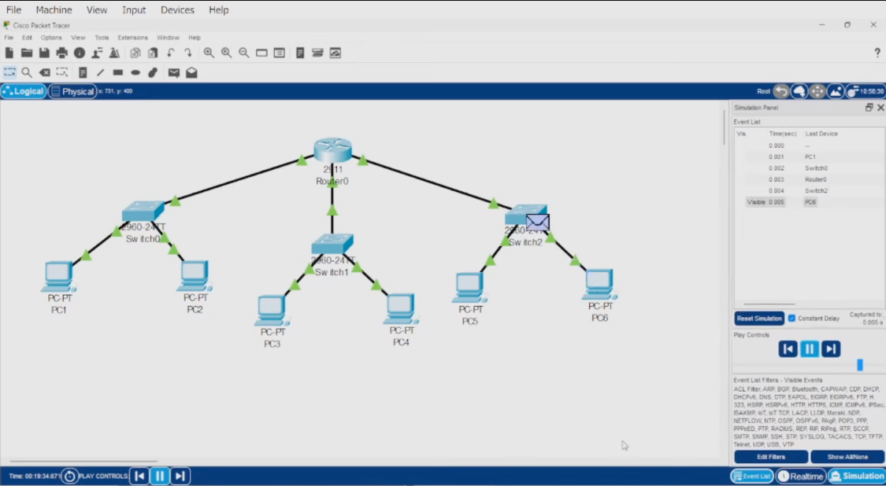

# Network-Design-Lab



## Overview

This network consists of three switches and six PCs connected to a single router (2911). The network is divided into three subnets, each connected to the router via a Gigabit Ethernet interface.

## Topology

*   **Router**: 2911 Router
*   **Switches**: Three 2960 Switches
*   **PCs**: Six PCs

## Addressing Scheme
```
Subnet 1: 10.1.1.0/24
    Router Interface (G0/0): 10.1.1.1
    PC1: 10.1.1.2
    PC2: 10.1.1.3

Subnet 2: 192.168.1.0/24
    Router Interface (G0/1): 192.168.1.1
    PC3: 192.168.1.2
    PC4: 192.168.1.3

Subnet 3: 192.168.2.0/24
    Router Interface (G0/2): 192.168.2.1
    PC5: 192.168.2.3
    PC6: 192.168.2.4
```
## Configuration

### Router Configuration

1.  Enable privileged EXEC mode:
enable


2.  Enter global configuration mode:

configure terminal


3.  Configure Gigabit Ethernet Interface 0/0:
```
interface G0/0
ip address 10.1.1.1 255.255.255.0
no shutdown
exit
```

4.  Configure Gigabit Ethernet Interface 0/1:
```
interface G0/1
ip address 192.168.1.1 255.255.255.0
no shutdown
exit
```

5.  Configure Gigabit Ethernet Interface 0/2:
```
interface G0/2
ip address 192.168.2.1 255.255.255.0
no shutdown
exit
```

### PC Configuration

Each PC is configured with a static IP address, subnet mask, and default gateway. The default gateway should be set to the IP address of the router's interface on the respective subnet.

## Connectivity Testing

Use the `ping` command to test connectivity between devices.
```
-  From PC1, ping PC3: `ping 192.168.1.2`
-  From PC1, ping PC5: `ping 192.168.2.3`
```
